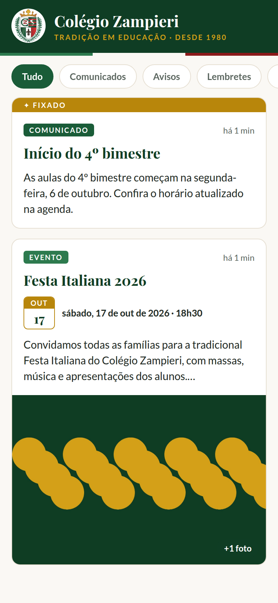
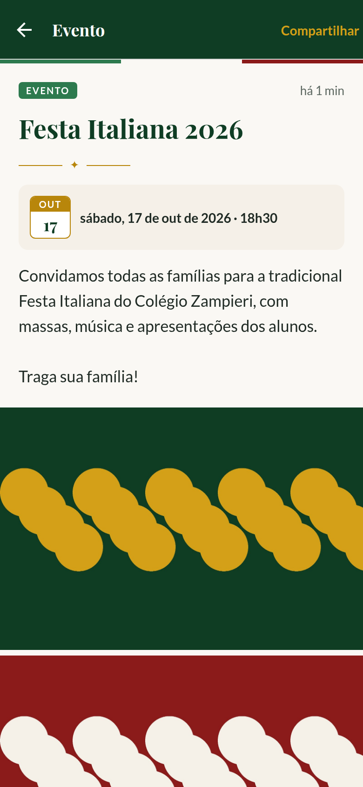
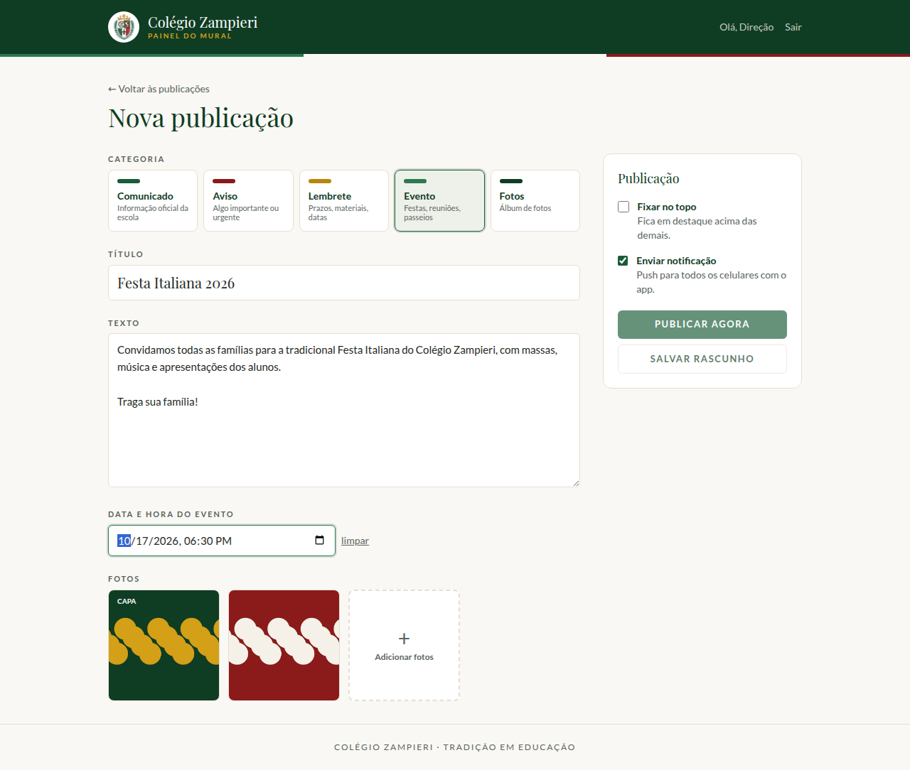
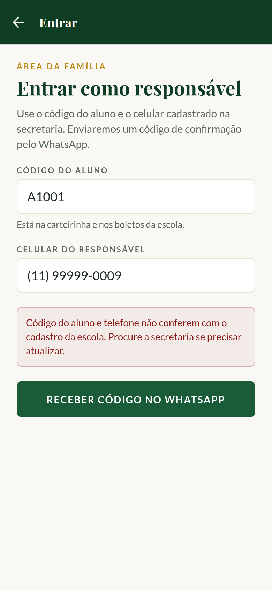
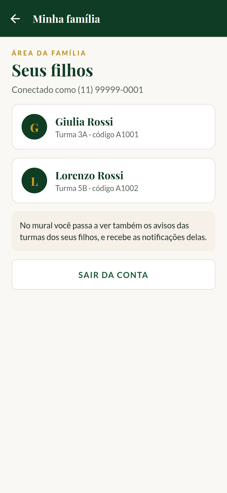
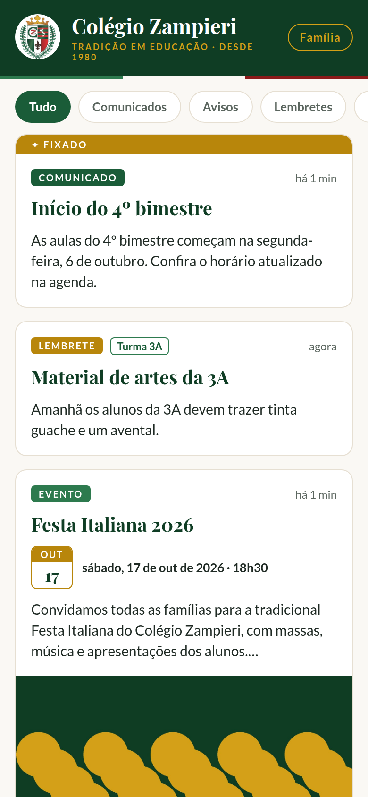
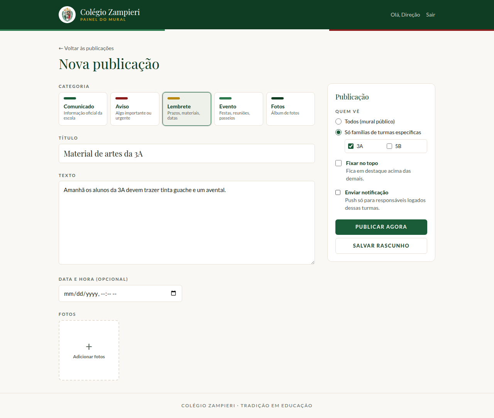

# Mural · Colégio Zampieri

Aplicativo de comunicação da escola: um mural com comunicados, avisos, lembretes, eventos e fotos,
com notificações push. As famílias usam o app **sem login**; a equipe publica pelo **painel admin**.

```
┌──────────────────────┐        ┌──────────────────────────┐        ┌───────────────────┐
│  app/  (Expo)        │  lê    │  Supabase                │ escreve│  admin/ (Next.js) │
│  iOS + Android       │◄───────│  Postgres + RLS          │◄───────│  painel da equipe │
│  sem login           │        │  Storage (fotos)         │        │  login por e-mail │
│  registra token push │───────►│  Auth (só admins)        │        │                   │
└──────────▲───────────┘        └──────────────────────────┘        └─────────┬─────────┘
           │                                                                  │
           │                 Expo Push Service → APNs (Apple) / FCM (Google)  │
           └──────────────────────────────────────────────────────────────────┘
```

| Pasta | O quê |
| --- | --- |
| `app/` | App mobile (Expo SDK 57, Expo Router). Mural com filtros, detalhe com fotos, convite para ativar notificações, deep link da notificação para a publicação. |
| `admin/` | Painel (Next.js 16). Login, lista de publicações, criar/editar/excluir, fixar no topo, upload de fotos (redimensionadas no navegador), envio de push. |
| `supabase/` | Migração do banco: tabelas, políticas RLS, bucket de fotos e função de registro de dispositivos. |

A identidade visual segue o manual: Verde Escuro `#0F3D24`, Verde Médio `#1A5C38`, Verde Claro `#2D7A4E`,
Vinho `#8B1A1A`, Dourado `#B8860B`, Dourado Claro `#D4A017`, Creme `#F5F0E8`, Branco Quente `#FAF8F4`;
títulos em Playfair Display e texto em Lato; faixa tricolor; slogan "Tradição em Educação".

## Login dos responsáveis (área da família)

O mural continua público. O login é opcional e libera os **avisos da turma dos filhos** (no mural e no push)
e a área "Minha família".

```
App: código do aluno + celular ──► painel /api/auth/solicitar ──► confere em alunos + aluno_responsaveis
                                                                  (e cria o usuário na 1ª vez)
App: signInWithOtp(celular) ──► Supabase gera o código ──► gancho /api/auth/enviar-codigo ──► WhatsApp
App: digita o código ──► verifyOtp ──► sessão salva no Keychain/Keystore do aparelho
App: (opcional) ativa Face ID / digital ──► nas próximas aberturas, a biometria destrava a sessão salva
```

- A biometria **não** é um login no servidor: ela protege a sessão já guardada no aparelho (mesmo modelo dos
  apps de banco). Trocar de celular ou sair da conta exige novo código pelo WhatsApp.
- Um responsável com vários filhos entra uma vez: todos os alunos ligados àquele telefone aparecem.
- Proteções: 5 tentativas erradas por telefone (20 por IP) a cada 15 min; telefone fora do cadastro não
  recebe código nem por chamada direta ao Supabase (o cadastro público está desligado); o código expira e
  não pode ser reutilizado (regras do Supabase Auth).

### Tabela de alunos

A secretaria (ou uma rotina de sincronização com o sistema da escola) mantém duas tabelas:

```sql
-- telefone: 55 + DDD + número, só dígitos
insert into public.alunos (codigo, nome, turma, ativo) values
  ('2024017', 'Giulia Rossi', '3A', true);
insert into public.aluno_responsaveis (aluno_codigo, telefone, nome) values
  ('2024017', '5511999998888', 'Ana Rossi');
```

Aluno com `ativo = false` deixa de dar acesso. As turmas cadastradas aparecem automaticamente no painel, no
seletor "Quem vê" de cada publicação.

> Ao inserir em lote pelo supabase-js, envie **todas** as colunas em todas as linhas (inclusive `ativo`):
> colunas ausentes em algumas linhas viram `null` e o lote inteiro é recusado.

## Segurança

- O app usa apenas a chave **anon** do Supabase. As políticas RLS só liberam leitura de publicações com
  `status = 'publicado'` e, se a publicação for de turmas específicas, só para responsáveis logados com filho
  ativo nessas turmas. Rascunhos nunca saem do banco para o app.
- Responsável logado só lê os próprios filhos e o próprio vínculo; não altera nada.
- Tokens de push ficam numa tabela **sem nenhuma política pública**. O app só consegue gravar via a função
  `registrar_push_token`, que valida o formato do token. Ninguém consegue listar os aparelhos pela API pública.
- Escrita (posts, fotos) exige usuário autenticado **e** presente na tabela `admins` — checado no banco
  (RLS) e no painel.
- A chave `service_role` fica só no servidor do painel, usada para ler tokens e enviar push.

## Passo a passo para colocar no ar

### 1. Supabase

1. Crie um projeto em <https://supabase.com> (região São Paulo).
2. Crie as tabelas: cole `supabase/instalacao_completa.sql` no **SQL Editor** e execute uma vez
   (ou, pela linha de comando, `npx supabase link --project-ref <ref>` e `npx supabase db push`).
   Use só um dos dois caminhos.
3. Em **Authentication → Providers → Email**, desative "Allow new users to sign up" — só você cria contas.
4. Crie cada pessoa da equipe em **Authentication → Users → Add user** e depois libere o acesso:

   ```sql
   insert into public.admins (user_id, nome)
   select id, 'Secretaria' from auth.users where email = 'secretaria@colegiozampieri.com.br';
   ```
5. Login por telefone:
   - **Authentication → Providers → Phone:** ative o provedor.
   - **Authentication → Hooks → Send SMS hook:** tipo HTTPS, URL
     `https://<domínio do painel>/api/auth/enviar-codigo` (só depois do painel no ar, passo 2). Gere o segredo e coloque o mesmo valor em
     `SUPABASE_AUTH_HOOK_SEND_SMS_SECRET` no painel.
   - **Authentication → Rate Limits:** o limite de SMS por hora vale para o projeto inteiro. Aumente antes de
     divulgar o app, senão o início do ano letivo esbarra nele.

### 2. Painel admin (`admin/`)

1. Copie `admin/.env.example` para `admin/.env.local` e preencha (URL, chave anon, chave service_role,
   `CRON_SECRET`, segredo do gancho e dados da API de WhatsApp).
   - `WHATSAPP_PROVEDOR=meta`: WhatsApp Cloud API oficial. Exige um template de **autenticação** aprovado
     pela Meta (nome em `WHATSAPP_TEMPLATE`, idioma pt_BR, com o código no corpo e no botão "copiar código").
   - `WHATSAPP_PROVEDOR=webhook` (**configuração da escola**): o painel faz `POST` no n8n
     (`https://n8ncz.colegiozampieri.com/webhook/template_app_mural`) com
     `Authorization: Bearer WHATSAPP_TOKEN` e o corpo JSON:

     ```json
     { "telefone": "5511999998888", "codigo": "412603",
       "mensagem": "Seu código de acesso ao app do Colégio Zampieri é 412603. Não compartilhe com ninguém." }
     ```

     No n8n: ative **Header Auth** no nó Webhook com o mesmo token, use `telefone` como destinatário e
     `codigo` como variável do template aprovado. Responda HTTP 200 só depois que o envio der certo — qualquer
     outro status faz o app mostrar "não foi possível enviar o código".
   - `WHATSAPP_PROVEDOR=log`: imprime o código no console (desenvolvimento; recusado em produção).
2. Rodar local: `cd admin && npm install && npm run dev` → <http://localhost:3000>.
3. Produção no **Easypanel** (servidor da escola):
   1. **DNS:** crie um registro A, por exemplo `painel-mural.colegiozampieri.com`, apontando para o IP do
      servidor.
   2. **Easypanel → projeto → + Service → App.**
      - **Source:** GitHub, repositório `alezlopez/mural-colegiozampieri`, branch de produção,
        **Build Path `/admin`**.
      - **Build:** Dockerfile (arquivo `admin/Dockerfile`).
   3. **Environment:** as variáveis do `admin/.env.example`. Todas são lidas quando o container inicia
      (nenhuma é necessária no build). Se faltar `SUPABASE_URL` ou `SUPABASE_ANON_KEY`, o log do serviço
      mostra "Variável de ambiente ausente".
   4. **Domains:** o domínio do passo 1, HTTPS ligado, porta **3000**.
   5. **Deploy.** Teste em `https://<domínio>/login`.
4. **Limpeza diária de aparelhos que desinstalaram o app:** no n8n, um fluxo com *Schedule Trigger*
   (1x por dia) e *HTTP Request* `GET https://<domínio>/api/cron/push-recibos` com o header
   `Authorization: Bearer <CRON_SECRET>`. Na Vercel isso seria feito pelo `vercel.json`, mas o plano
   gratuito da Vercel é só para uso não comercial.

### 3. App (`app/`)

1. Copie `app/.env.example` para `app/.env` com a URL e a chave **anon** (nunca a service_role) e o
   endereço do painel em `EXPO_PUBLIC_API_URL`.
2. `cd app && npm install`
3. Crie a conta Expo e vincule o projeto: `npx eas-cli@latest login` e `npx eas-cli@latest init`
   (isso grava o `projectId`, necessário para o push).
4. Credenciais de push:
   - **Android:** projeto no Firebase + chave FCM v1 enviada ao EAS
     ([guia](https://docs.expo.dev/push-notifications/fcm-credentials/)).
   - **iOS:** conta Apple Developer (paga); o `eas build` gera a chave APNs.
5. Build de desenvolvimento para testar em aparelho: `npx eas-cli@latest build --profile development`.
   **Push não funciona no Expo Go** (limitação do Expo desde o SDK 53).
6. Publicação nas lojas: `npx eas-cli@latest build --platform all` e `npx eas-cli@latest submit`.

O app também roda no navegador (`npx expo start --web`) para conferir o layout, mas sem push e sem biometria.

### Desenvolvimento local com Supabase CLI

```sh
export SUPABASE_AUTH_HOOK_SEND_SMS_URI=http://host.docker.internal:3000/api/auth/enviar-codigo
export SUPABASE_AUTH_HOOK_SEND_SMS_SECRET="v1,whsec_$(openssl rand -base64 32)"
npx supabase start            # aplica as migrações
```

Use o mesmo segredo no `admin/.env.local` e `WHATSAPP_PROVEDOR=log` para ver o código no console do painel.

## Próximos passos já previstos na estrutura

- **Portal do aluno / Clube Zampieri:** o login do responsável já existe; novas telas leem dados filtrados
  por `minhas_turmas()` / vínculo do telefone, no mesmo padrão de RLS.
- **Agendamento de publicações:** exige uma rotina agendada para disparar o push na hora certa.

## Telas

| App — mural | App — publicação | Painel — nova publicação |
| --- | --- | --- |
|  |  |  |

| App — entrar | App — minha família | App — mural logado (aviso da turma) | Painel — publicar para uma turma |
| --- | --- | --- | --- |
|  |  |  |  |
